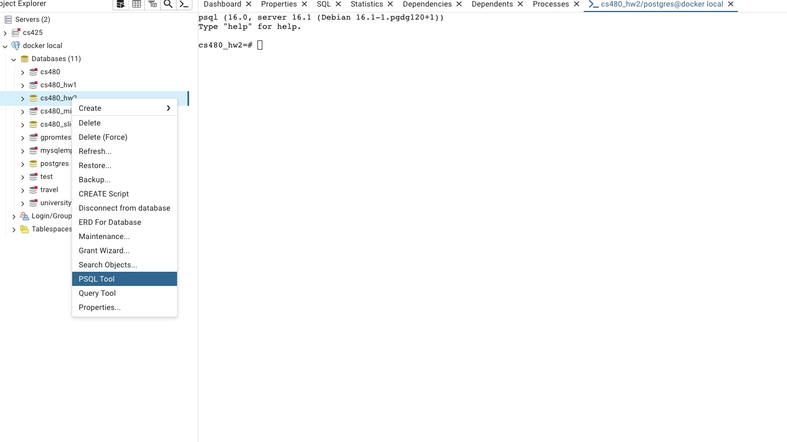
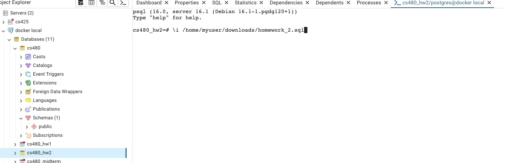

This readme provides some help for how to do administrative tasks with Postgres.

# pg_dump

## What is pg_dump?

`pg_dump` is a tool to export the content of a Postgres database in several formats. The exported database can then be loaded on a different server.

## How to load a pg_dump SQL script


### Using psql

First you need to connect to the database by providing the right connection parameters to `psql`.

- `YOUR_POSTGRES_USER`: is the name of the database user you want to connect to. Many postgres installations create a `postgres` user or create a database user with the same name as your OS user.
- `YOUR_POSTGRES_HOST`: the IP address or host name of the server running postgres. For local installations this would be `127.0.0.1`.
- `YOUR_DATABASE_NAME`: the database you want to connect to

```sh
psql -U [YOUR_POSTGRES_USER] -h [YOUR_POSTGRES_HOST] -d [YOUR_DATABASE_NAME]
```

If you are running postgres on a non-standard port (not the postgres default port of `5432`, then you have to additionally pass the `-p [YOUR_PORT]` option.

If you connect successfully, you should see a REPL like this:

```sh
$psql -h 127.0.0.1 -U postgres -p 5450 -d cs480
WARNING: psql major version 14, server major version 16.
         Some psql features might not work.
Type "help" for help.

cs480=#
```

You can now type queries and run backslash commands. To test this maybe run the following query over the system catalog:

```sql
SELECT * FROM pg_tables;
```

#### psql backslash commands

psql provides special commands that start with a backslash. Some important ones:

- `\q` = quit psql
- `\?` = show help about backslash commands
- `\i [FILE]` = execute SQL commands from `[FILE]`

#### Loading data

To load data from a file, e.g., the `homework_2.sql` script, let us assume you have stored the script in folder `/home/myuser/homework_2.sql`. Then you can run inside a `psql` session.

```sh
\i /home/myuser/homework_2.sql
```

### Using pgadmin4

**Note: pg_dump copies data from stdin which is not supported in the pgadmin4 query tool. Follow these instructions to load a pg_dump SQL script**

So you cannot use the pgadmin4 query tool. Instead you can open a psql session from within pgamdin.




#### Open psql session

On the left side, right click on the database you want to connect to and select `PSQL Tool`. Then run the load as shown above for psql.


